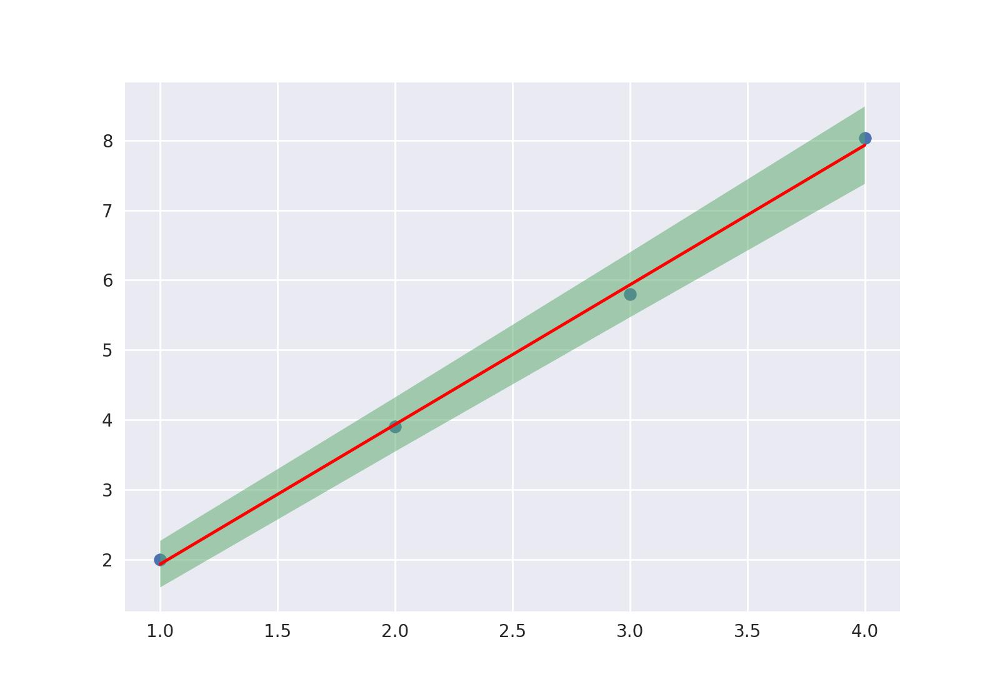

É um caso especial da [Regressão Polinomial](polinomial.md) (grau=1).


Regressão linear usando o método dos [mínimos quadrados](https://www.researchgate.net/publication/337103890_Linear_Least_Squares_Versatile_Curve_and_Surface_Fitting_CDT-17), o código é escrito usando a função 
`polyfit` do numpy, a sua grande vantagem é que são aceitas Medidas nos arrays \(x\) e \(y\).

É retornado os coeficientes da reta como Medidas com seus erros estimados, um detalhe é que 
os coeficientes são ordenados com **grau crescente (\(b+ax\) e não \(ax+b\))**


```{.py3 title="Exemplo"}
    x_dados=np.array([1, 2, 3, 4])
    y_dados=np.array([2.1 , 3.9 , 5.8 , 8.03])
    b,a = regressao_linear(x_dados,y_dados) 
    #b=(0.0 ± 0.1) a=(1.99 ±0.05)
```

## Retornar função
Para criação de gráficos, às vezes é mais prático a `regressao_linear` retornar
uma função linear do que os coeficientes, com o parametro extra `func=True` isso
é possível. É retornado um [MPolinomio](../MPolinomio/Introdução.md) que atua como função

```{.py3 linenums=1 hl_lines="3"}
    x_dados=np.array([1, 2, 3, 4])
    y_dados=np.array([2 , 3.9 , 5.8 , 8.03])
    linha= regressao_linear(x_dados,y_dados,func=True) 
    x=np.linspace(1,4,100)
    y=linha(x)
```

o [MPolinomio](../MPolinomio/Introdução.md) quando calculado nos valores de x,
irá retornar um array de Medidas que junto com os métodos [CurvaMin](../Arrays/Incertezas.md) e 
[CurvaMax](../Arrays/CurvaMinMax.md) é possível criar facilmente um gráfico com o erro
estimado da reta

```{.py3 linenums=5}
    import matplotlib.pyplot as plt
    plt.scatter(x_dados,y_dados)
    plt.plot(x,y,color='r')
    plt.fill_between(x,CurvaMin(y),CurvaMax(y),alpha=0.5)
```

